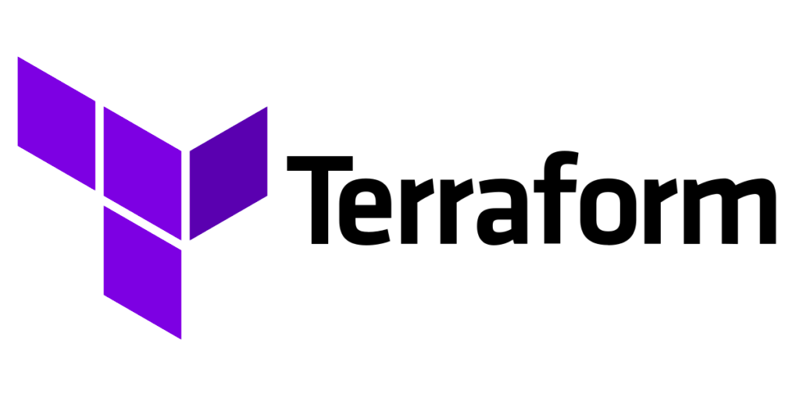

# terraform-cookbook

## Table of contents:
- [Deploy single EC2 instance with SSH keys generated and NGINX web server installed](./nginx-webserver-ec2/)
- [TeamCity deployed on AWS](./teamcity-on-aws/)
- [Terraform remote state S3 backend and DynamoDB for state locking](./s3-dynamodb-backend/)
- [Use open-source SOPS tool to handle sensitive values in Terraform code](./secrets-mgmt-with-sops/)
- [Use AWS Secrets Manager to handle sensitive values in Terraform code](./aws-secrets-manager/)
