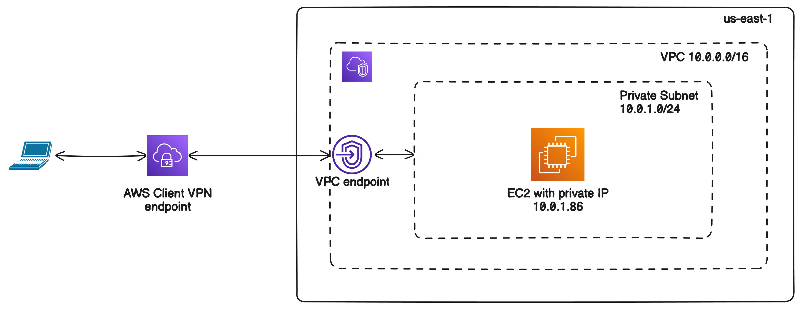
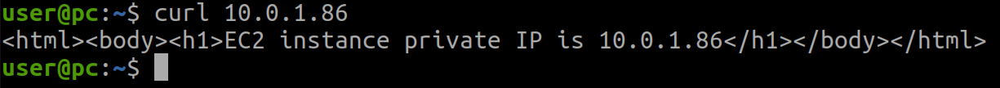

# Implement AWS Client VPN to connect to private EC2 instance

This project shows how to provision [AWS Client VPN service](https://docs.aws.amazon.com/vpn/latest/clientvpn-admin/what-is.html) to connect to private resources in VPC. In this example, we're connecting to an EC2 instance in a private subnet. VPC is custom defined and do not have any public subnets, IGW or Elastic IPs for outside world Internet connection.



AWS Client VPN provisioned in [mutual authentication mode](https://docs.aws.amazon.com/vpn/latest/clientvpn-admin/mutual.html), meaning Client VPN uses certificates to perform authentication between the client and the server. It also means that [no self-service portal can be provisioned when mutual authentication is used](https://docs.aws.amazon.com/vpn/latest/clientvpn-admin/cvpn-self-service-portal.html). 

## Client VPN

AWS Client VPN provisioned via the following module: [https://registry.terraform.io/modules/babicamir/vpn-client/aws/latest](https://registry.terraform.io/modules/babicamir/vpn-client/aws/latest)

This module creates a separate private S3 bucket, where it stores generated `.ovpn` OpenVPN configuration files for connection.

Set `split` attribute to `true` if you want to be able make other connections in parallel with VPN (Internet, etc). Otherwise set it to `false` to keep connection only to VPN tunnel. For more information, see [Split-tunnel on Client VPN endpoints](https://docs.aws.amazon.com/vpn/latest/clientvpn-admin/split-tunnel-vpn.html)

## S3 bucket with OpenVPN config files

Use these commands to list and download your OpenVPN config files. 

To list all your S3 buckets:
```bash
aws s3api list-buckets --query "Buckets[].Name" --output table
```

To list object in S3 bucket:
```bash
aws s3api list-objects --bucket <bucket-name> --prefix <prefix>
```

To download specific object from S3 bucket:
```bash
aws s3 cp s3://<bucket-name>/<object-key> <local-file-path>
```

## Connect to VPN

After you download OpenVPN config file, connect to VPN via:
```bash
sudo openvpn --config <file>.ovpn
```

**NOTE**  
For OpenVPN installation on Ubuntu, see [How to install and use OpenVPN](https://ubuntu.com/server/docs/how-to-install-and-use-openvpn#simple-client-configuration)

## Verify VPN connection

For connection verification, ensure that you have installed:
```bash
sudo apt install net-tools
sudo apt install traceroute
```

To check the VPN connection route:
```bash
route -n
```


To see the hops:
```bash
traceroute <ec2_private_ip>
```

Ping EC2:
```bash
ping <ec2_private_ip>
```

To connect to web server running on EC2 port 80:
```bash
curl <ec2_private_ip>
```



## Troubleshooting

EC2 instance is configured with SSM connection. This allows to connect to private EC2 instance without using any SSH keys and public endpoints. For more information, see [github.com/Brain2life/terraform-cookbook/tree/main/aws-ssm-ec2-connect](https://github.com/Brain2life/terraform-cookbook/tree/main/aws-ssm-ec2-connect)

To connect to EC2 instance:
```bash
aws ssm start-session --target <instance-id>
```

To find out EC2 instance ID:
```bash
aws ec2 describe-instances \
  --region us-east-1 \
  --filters "Name=instance-state-name,Values=running" \
  --query "Reservations[*].Instances[*].InstanceId" \
  --output text
```

General troubleshooting steps:
- Check SG configuration if it allows web and ICMP traffic
- Check if Bash script for deploying web service is running
- Check if VPC and Subnet ID's are specified correctly
- Check if client's CIDR range do not overlap with target VPC's CIDR range