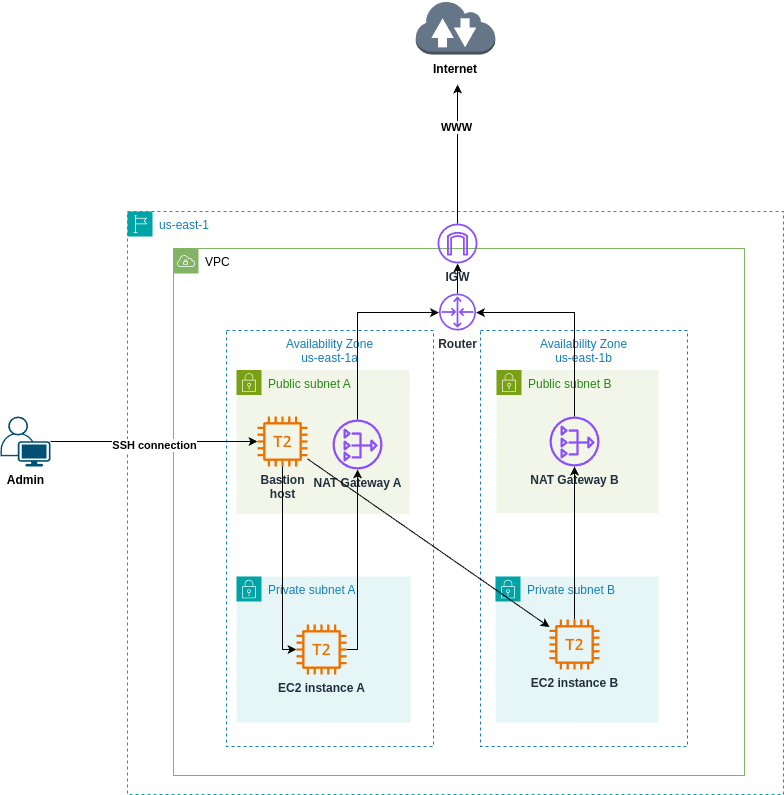
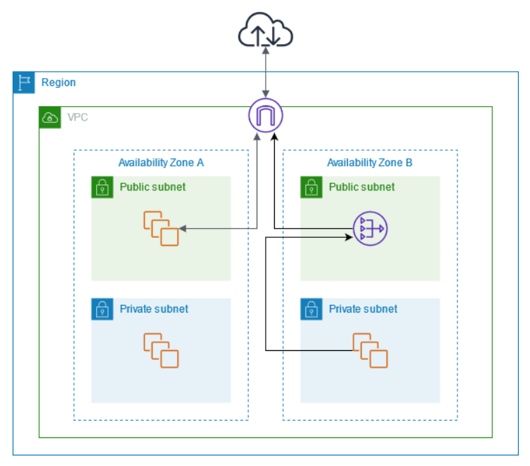

# Example of NAT Gateway with High Availability

This example project showcases how to achieve fault tolerance of NAT Gateways by deploying them into different AZs. Each NAT gateway is created in a specific Availability Zone and implemented with redundancy in that zone.

To learn more about NAT Gateways, see [NAT Gateway Basics](https://docs.aws.amazon.com/vpc/latest/userguide/nat-gateway-basics.html)



The NAT gateways in public subnets enable instances in a private subnet to send outbound traffic to the internet, while preventing the internet from establishing connections to the instances. To learn more about different use cases, see [NAT Gateway scenarios](https://docs.aws.amazon.com/vpc/latest/userguide/nat-gateway-scenarios.html).

## Create a Key Pair

To be able to SSH into Bastion host and private instances, provision the SSH key:
```bash
aws ec2 create-key-pair --key-name ssh-key-pair --query 'KeyMaterial' --output text > ssh-key-pair.pem
chmod 400 ssh-key-pair.pem
```

**Transfer SSH key into Bastion host**  
In order to SSH into private instance from Bastion host, you need to transfer the SSH key. One of the option is to create the key on Bastion host:
```bash
# Copy the contents of the private SSH key from local machine
xclip -sel clip < ssh-key-pair.pem

# On Bastion host machine
touch ssh-key-pair.pem
chmod 400 ssh-key-pair.pem

# Paste the contents of the private SSH key
vim ssh-key-pair.pem
```

## Initialize the project

Run the following commands to deploy the infrastructure:
```bash
terraform init
terraform apply
```

## Verify the connection to the Internet from private instance

SSH into private instance from Bastion host:
```bash
ssh -i ssh-key-pair.pem ubuntu@<private_ip>
```

Ping `google.com`:
```bash
ping google.com
```

## Pros and Cons of this approach

### **Pros**
1. **High Availability:**
   - Each NAT Gateway is tied to a specific Availability Zone (AZ). By provisioning one NAT Gateway per AZ, you ensure that private instances in one AZ can still access the internet if another AZ fails.

2. **Reduced Latency:**
   - Private instances route internet-bound traffic to the NAT Gateway in their AZ. This avoids cross-AZ traffic, reducing latency and improving performance.

3. **Fault Isolation:**
   - If a NAT Gateway or its associated infrastructure in one AZ fails, private instances in other AZs remain unaffected.

4. **Scalability:**
   - Traffic is distributed across multiple NAT Gateways, reducing the chance of any single NAT Gateway becoming a bottleneck.

---

### **Cons**
1. **Higher Costs:**
   - AWS charges per NAT Gateway and for data transfer. Having multiple NAT Gateways increases these costs, especially in scenarios with low traffic volumes.

2. **Management Overhead:**
   - This setup requires careful management of route tables and associations for each AZ, which can add complexity to the infrastructure.

3. **Underutilization:**
   - In low-traffic environments, multiple NAT Gateways might be underutilized, leading to inefficient resource usage.

4. **Complexity for Scaling Across AZs:**
   - When expanding to more AZs, you'll need to add additional NAT Gateways and update route tables, increasing maintenance effort.

---

### **Alternatives**
1. **Single NAT Gateway (Lower Cost, Lower Resilience):**
   - A single NAT Gateway shared across all private subnets reduces costs but introduces a single point of failure and higher cross-AZ traffic costs.

   

2. **NAT Instances:**
   - NAT Instances can replace NAT Gateways for lower costs in some cases, but they require manual scaling, patching, and monitoring, making them less resilient and more management-intensive. For more information, see [this example project](https://github.com/Brain2life/terraform-cookbook/tree/main/nat-instance-setup-for-nonprod).

---

### **When to Use This Setup**
- Your workload is **highly available** across multiple AZs.
- Your application has **significant internet-bound traffic**, justifying the cost of multiple NAT Gateways.
- You prioritize **resilience and performance** over cost.

---

### **When to Consider Alternatives**
- You have a **low-traffic environment** with minimal outbound internet usage.
- Cost is a **major constraint**.
- You don’t require **strict fault isolation** across AZs.

---

This setup is ideal for production environments requiring high availability and scalability, but less suitable for cost-sensitive or low-traffic environments.

## References
- [AWS Docs: NAT gateways](https://docs.aws.amazon.com/vpc/latest/userguide/vpc-nat-gateway.html)
- [CloudZero Blog: AWS NAT Gateway Pricing: Simple Strategies To Limit Costs](https://www.cloudzero.com/blog/reduce-nat-gateway-costs/)