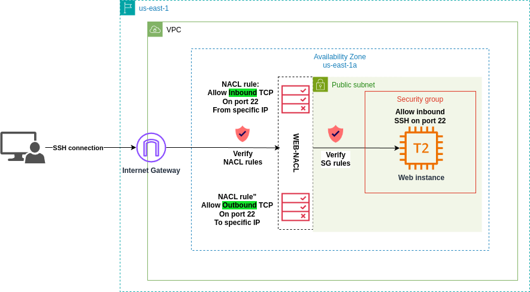

# AWS Network Access Control List (NACL) and Security Groups (SGs) basics

This project demonstrates the working logic of two foundational network security features in AWS: [**Network Access Control Lists (NACLs)**](https://docs.aws.amazon.com/vpc/latest/userguide/vpc-network-acls.html) and [**Security Groups (SGs)**](https://docs.aws.amazon.com/vpc/latest/userguide/vpc-security-groups.html).



# Table of contents:
- [Level of Operation](#level-of-operation)
- [Rules Structure](#rules-structure)
- [Rule Evaluation](#rule-evaluation)
- [Default Security Group](#default-security-group)
- [Use Cases](#use-cases)
- [When to Use Each](#when-to-use-each)
- [Best Practices](#best-practices)
- [Example Scenario](#example-scenario)
- [Project setup](#project-setup)
   - [Create a Key Pair](#create-a-key-pair)
   - [Initialize the project](#initialize-the-project)
   - [Verify the connection to the Web instance](#verify-the-connection-to-the-web-instance)
   - [Change NACL rule to deny traffic](#change-nacl-rule-to-deny-traffic)
- [References](#references)

AWS **Network ACLs (NACLs)** and **Security Groups** are critical components of network security in AWS. Both serve to control inbound and outbound traffic, but they operate at different layers and have distinct use cases.

---

### **Level of Operation**
- **Security Groups:**
  - Operate at the instance level (virtual firewall for an instance).
  - Attached to EC2 instances or other resources.

  

- **NACLs:**
  - Operate at the subnet level.
  - Automatically apply to all instances within the associated subnet.

  

---

### **Rules Structure**
- **Security Groups:**
  - Allow-only rules. [You cannot explicitly deny traffic](https://docs.aws.amazon.com/vpc/latest/userguide/security-group-rules.html); you can only specify what to allow.
  - Stateful: Return traffic for allowed inbound traffic is automatically allowed, and vice versa.

- **NACLs:**
  - [Allow and deny rules](https://docs.aws.amazon.com/vpc/latest/userguide/nacl-rules.html). You can explicitly deny traffic.
  - Stateless: Return traffic must be explicitly allowed by a separate rule.

---

### **Rule Evaluation**
- **Security Groups:**
  - Rules are evaluated collectively. This means that if you attach several SG rules like allowing traffic on port 443 and 22, then both will be allowed.
  - If any rule matches, the traffic is allowed.

- **NACLs:**
  - Rules are evaluated in order, based on rule number (starting with the lowest).
  - Once a rule matches, evaluation stops.

---

### **Default Security Group**
- **Security Groups:**
  - Default rule of the default security group allows inbound traffic from all resources that are assigned to this security group and allows all outbound traffic.
  
  The following table describes the default inbound rules for a default security group.

  

  The following table describes the default outbound rules for a default security group.

  

- **Example:**  
The following diagram shows a VPC with a default security group, an internet gateway, and a NAT gateway. The default security contains only its default rules, and it is associated with two EC2 instances running in the VPC. In this scenario, each instance can receive inbound traffic from the other instance on all ports and protocols. The default rules do not allow the instances to receive traffic from the internet gateway or the NAT gateway. If your instances must receive additional traffic, it is recommended that you create a security group with the required rules and associate the new security group with the instances instead of the default security group.


- **NACLs:**
  - Default NACL [allows all inbound and outbound traffic](https://docs.aws.amazon.com/vpc/latest/userguide/default-network-acl.html).
  - Custom NACLs [deny all traffic by default](https://docs.aws.amazon.com/vpc/latest/userguide/custom-network-acl.html) until rules are added.

---

### **Use Cases**
- **Security Groups:**
  - Best for fine-grained control at the instance level.
  - Use when you need to manage security for individual EC2 instances or groups of instances.
  - Ideal for application-level controls, such as allowing traffic to a web server (HTTP, HTTPS) or database server (MySQL, PostgreSQL).

- **NACLs:**
  - Best for broader control at the subnet level.
  - Use to provide an additional layer of security for subnets in a VPC.
  - Ideal for network-level controls, such as blocking a specific IP range or restricting traffic based on a port across multiple instances.

---

### **When to Use Each**
1. **Use Security Groups:**
   - When you want granular control of traffic to individual instances.
   - To manage instance-specific protocols and ports (e.g., HTTP, SSH, database).
   - In combination with Auto Scaling groups or when instance IPs are dynamic.

2. **Use NACLs:**
   - When you need to enforce broad rules that apply to all instances in a subnet.
   - To block specific IP ranges or ports at the subnet level.
   - When you want a stateless firewall that applies universally to all traffic entering or exiting a subnet.

---

### **Best Practices**
1. **Layered Security:** Use both Security Groups and NACLs together for defense-in-depth:
   - NACLs as a coarse-grained, subnet-level firewall.
   - Security Groups for fine-grained, instance-level access control.
   
2. **Least Privilege:** Allow only the traffic necessary for your application and block everything else.

3. **Test Changes:** Before implementing rules in production, test them in a staging environment to ensure they function as intended.

---

### **Example Scenario**
**Web Application Deployment:**
- **Security Group:**
  - Allow inbound HTTP/HTTPS (80/443) and SSH (22) traffic from specific IPs to the web server.
  - Allow MySQL traffic (3306) from the application servers to the database instance.

- **NACL:**
  - Deny traffic from malicious IP ranges at the subnet level.
  - Allow HTTP/HTTPS (80/443) traffic to the subnet and block everything else not explicitly allowed.

By using NACLs and Security Groups appropriately, you ensure a robust, multi-layered security posture in your AWS environment.

---

## **Project setup**  

### **Create a Key Pair**  
To be able to SSH into Web instance, provision the SSH key:
```bash
aws ec2 create-key-pair --key-name ssh-key-pair --query 'KeyMaterial' --output text > ssh-key-pair.pem
chmod 400 ssh-key-pair.pem
```

### **Initialize the project**
Run the following commands to deploy the infrastructure:
```bash
terraform init
terraform apply
```

### Verify the connection to the Web instance
SSH into Web instance:
```bash
ssh -i ssh-key-pair.pem ubuntu@<public_ip>
```

### Change NACL rule to deny traffic
To see NACL rules in action, deny SSH traffic on subnet level and try to reconnect to Web instance via SSH:


As a result you won't be able to connect to Web instance despite the fact that you have allowed inbound SSH traffic on Security Group level.

### **References**

- [AWS Docs: Control subnet traffic with network access control lists](https://docs.aws.amazon.com/vpc/latest/userguide/vpc-network-acls.html)
- [AWS Docs: Security Groups](https://docs.aws.amazon.com/vpc/latest/userguide/vpc-security-groups.html)
- [Cloudviz Blog: AWS Security Group vs NACL](https://cloudviz.io/blog/aws-security-group-vs-nacl)