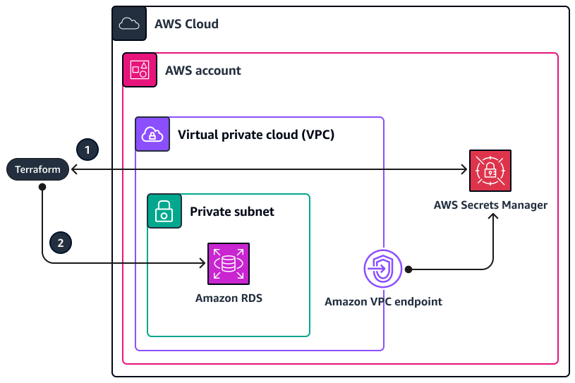
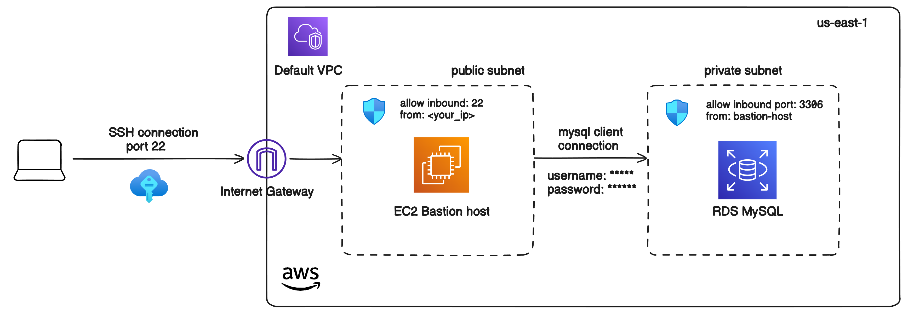

## Handling sensitive data in Terraform code with AWS Secrets Manager

[AWS Secrets Manager](https://docs.aws.amazon.com/secretsmanager/latest/userguide/intro.html) provides a secure way to store and manage sensitive information. This template shows how to securely handle RDS instance credentials in Terraform by integrating AWS Secrets Manager.

Secrets Manager uses 256-bit Advanced Encryption Standard (AES) symmetric data keys to encrypt secret values. For more information, see [Secret encryption and decryption in AWS Secrets Manager](https://docs.aws.amazon.com/secretsmanager/latest/userguide/security-encryption.html).

**NOTE**  
AWS Secrets Manager is paid service. For more information, see [AWS Secrets Manager Pricing](https://aws.amazon.com/secrets-manager/pricing/)

## Overview

This template uses random secrets generation when you deploy IaC help you protect sensitive data from the very start, known as *zero hours*. The sensitive data is never known to anyone, right from the deployment phase.



1. Through Terraform, use AWS Secrets Manager to generate a random password secret.
2. Terraform uses this random password secret, which is stored in AWS Secrets Manager, to access the database.

**NOTE**  
**Sensitive data is visible in plain text in the Terraform state file**. To help protect sensitive data, store the Terraform state file in the remote backend with encryption enabled at-rest and in-transit. For example, use AWS S3 remote backend and DynamoDB table for state locking. For more information, see [S3 DynamoDB Backend](../s3-dynamodb-backend/)

## Getting generated random password and secret values

To get generated random password and secret values stored in AWS Secrets Manager via AWS CLI:
```bash
aws secretsmanager get-secret-value --secret-id my-org/my-env/my-rds-secret
```

To extract password from secret values, first ensure that you have `jq` installed:
```bash
sudo apt-get update
sudo apt-get install jq
```

Extract the password:
```bash
aws secretsmanager get-secret-value \
  --secret-id my-org/my-env/my-rds-secret \
  --query SecretString \
  --output text | jq -r '.password'
```

## Check connection to the RDS instance

This template uses EC2 bastion host in public subnet to access RDS instance with `mysql` client as shown in the following diagram:



**NOTE**  
Generate public and private SSH keys before running terraform code. Store them in the default `~/.ssh` path.

1. To get public IP address of running EC2 instances in your account:
```bash
aws ec2 describe-instances \
  --filters "Name=instance-state-name,Values=running" \
  --query 'Reservations[*].Instances[*].{InstanceID:InstanceId,PublicIP:PublicIpAddress}' \
  --output table
```
2. To connect to the bastion host:
```bash
ssh ubuntu@<bastion_host_public_ip>
```
3. To connect to the RDS instance:
```bash
sudo mysql -h <rds_endpoint> <db_name> -u <username> -p <password>
```

## References
- [AWS Docs: Using Secrets Manager and Terraform](https://docs.aws.amazon.com/prescriptive-guidance/latest/secure-sensitive-data-secrets-manager-terraform/using-secrets-manager-and-terraform.html)
- [YouTube HashiCorp: How Secure are Your Sensitive Values in Terraform? Common Pitfalls of Scale Factory's Clients](https://www.youtube.com/watch?v=zYAuVrLacGc)
- [Data source: aws_secretsmanager_random_password](https://registry.terraform.io/providers/hashicorp/aws/latest/docs/data-sources/secretsmanager_random_password)
- [Resource: aws_secretsmanager_secret_version](https://registry.terraform.io/providers/hashicorp/aws/latest/docs/resources/secretsmanager_secret_version)
- [Resource: aws_secretsmanager_secret](https://registry.terraform.io/providers/hashicorp/aws/latest/docs/resources/secretsmanager_secret)
- [AWS Secrets Manager Pricing](https://aws.amazon.com/secrets-manager/pricing/)