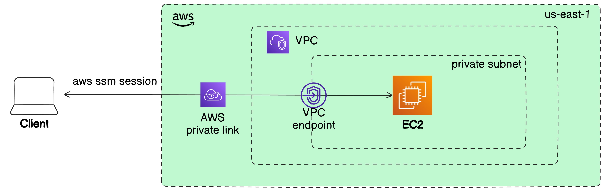

# Connect to private EC2 instance via AWS SSM

This project provides example of how you can use the AWS Systems Manager Session Manager to securely connect to an Amazon Elastic Compute Cloud (Amazon EC2) bastion host without using any long-lived SSH keys.

## Architecture


## Overview

**Stack**  
- A VPC with a single private subnet with EC2 instance running inside
- IAM role and instance profile 
- Amazon VPC security groups and security group rules for the endpoints and EC2 instance

**Technologies**  
- [AWS Systems Manager (SSM) Session Manager](https://docs.aws.amazon.com/systems-manager/latest/userguide/session-manager.html) -  is a fully managed service that allows you to securely access and manage your EC2 instances without requiring SSH or RDP access. By using the AWS Management Console, AWS CLI, or SDKs, you can establish sessions to your instances through encrypted channels, ensuring secure communication. No open inbound ports and no need to manage bastion hosts or SSH keys
- [EC2 instance profile](https://docs.aws.amazon.com/IAM/latest/UserGuide/id_roles_use_switch-role-ec2_instance-profiles.html) - is a container for an IAM role that allows EC2 instances to interact with other AWS services securely. Instead of embedding AWS access keys and secrets within your application, which poses security risks, an instance profile provides temporary, rotating credentials for an EC2 instance to access AWS resources according to the permissions of its associated IAM role.
- [AWS PrivateLink](https://aws.amazon.com/privatelink/) - provides secure and private connectivity between Virtual Private Clouds (VPCs) and AWS services or third-party services over the Amazon network. With PrivateLink, you can connect to services in a highly secure way without traversing the public internet. Instead, the data stays within AWS’s private network, reducing exposure to potential security threats and improving latency and reliability.

## Prerequisites

To connect to an EC2 instance in a private subnet using AWS Systems Manager (SSM), you’ll need to ensure a few prerequisites are met:

1. **SSM Agent**: Confirm that the SSM agent is installed and running on your EC2 instance. Some AMIs already have agent pre-installed. For more information, see [Find AMIs with the SSM Agent preinstalled](https://docs.aws.amazon.com/systems-manager/latest/userguide/ami-preinstalled-agent.html). This example template uses Amazon Linux 2 image with pre-installed agent. For manual installation, refer to [Manually installing and uninstalling SSM Agent on EC2 instances for Linux.](https://docs.aws.amazon.com/systems-manager/latest/userguide/manually-install-ssm-agent-linux.html)
2. **SSM plugin for AWS CLI**: Configure your AWS CLI with SSM plugin. For more information, see [Install the Session Manager plugin for the AWS CLI](https://docs.aws.amazon.com/systems-manager/latest/userguide/session-manager-working-with-install-plugin.html) 
3. **IAM Role**: Attach an IAM role to the instance with the [`AmazonSSMManagedInstanceCore`](https://docs.aws.amazon.com/aws-managed-policy/latest/reference/AmazonSSMManagedInstanceCore.html) policy. This allows SSM to connect to the instance.
4. **VPC Endpoints** (Optional): If your instance doesn’t have direct internet access, set up VPC endpoints for SSM and for EC2 messages. For more information, see [Improve the security of EC2 instances by using VPC endpoints for Systems Manager](https://docs.aws.amazon.com/systems-manager/latest/userguide/setup-create-vpc.html)

**NOTE**  
The alternative to using a VPC endpoint is to allow outbound internet access on your managed instances. In this case, the managed instances must also allow HTTPS (port 443) outbound traffic to the following endpoints:
- `ssm.region.amazonaws.com` - The endpoint for the Systems Manager service.
- `ssmmessages.region.amazonaws.com` - Systems Manager uses this endpoint to make calls from SSM Agent to the Systems Manager service.
- `ec2messages.region.amazonaws.com` - Session Manager uses this endpoint to connect to your EC2 instance through a secure data channel.

Set your value for `region`.

Once these are set up, you can connect to the instance using the following steps:

## Start the SSM Session

Run the following command to start an SSM session to your instance, substituting `<instance-id>` with the actual instance ID:

```bash
aws ssm start-session --target <instance-id> --profile <profile-name>
```

To retrieve the instance ID of an EC2 instance via tag name:
```bash
aws ec2 describe-instances \
    --filters "Name=tag:Name,Values=<value-of-name-tag" \
    --query "Reservations[*].Instances[*].InstanceId" \
    --output text --profile <profile-name> --region <region>
```

### Example

If your instance ID is `i-0abcd1234efgh5678`, the command would be:

```bash
aws ssm start-session --target i-0abcd1234efgh5678 --profile my-profile --region us-east-1
```

### Troubleshooting Tips
- If the command fails, check your instance’s IAM role and ensure it has the necessary permissions.
- Verify that the instance shows as “managed” in the Systems Manager console in Fleet Manager tab.
- Ensure the required VPC endpoints are set up if the instance lacks internet access.

This should establish an SSM session to your instance in the private subnet without requiring a direct SSH connection.

## Code structure

### Resources

| Name | Type |
|------|------|
| [aws_iam_instance_profile.ec2](https://registry.terraform.io/providers/hashicorp/aws/latest/docs/resources/iam_instance_profile) | resource |
| [aws_iam_role.ec2](https://registry.terraform.io/providers/hashicorp/aws/latest/docs/resources/iam_role) | resource |
| [aws_iam_role_policy_attachment.ssm_managed_ec2](https://registry.terraform.io/providers/hashicorp/aws/latest/docs/resources/iam_role_policy_attachment) | resource |
| [aws_instance.ec2](https://registry.terraform.io/providers/hashicorp/aws/latest/docs/resources/instance) | resource |
| [aws_security_group.ec2_all](https://registry.terraform.io/providers/hashicorp/aws/latest/docs/resources/security_group) | resource |
| [aws_security_group.ssm_https](https://registry.terraform.io/providers/hashicorp/aws/latest/docs/resources/security_group) | resource |
| [aws_subnet.subnet](https://registry.terraform.io/providers/hashicorp/aws/latest/docs/resources/subnet) | resource |
| [aws_vpc.main](https://registry.terraform.io/providers/hashicorp/aws/latest/docs/resources/vpc) | resource |
| [aws_vpc_endpoint.ssm_endpoint](https://registry.terraform.io/providers/hashicorp/aws/latest/docs/resources/vpc_endpoint) | resource |
| [aws_ami.amazon_linux_2](https://registry.terraform.io/providers/hashicorp/aws/latest/docs/data-sources/ami) | data source |

### Inputs

| Name | Description | Type | Default | Required |
|------|-------------|------|---------|:--------:|
| <a name="input_common_tags"></a> [common\_tags](#input\_common\_tags) | Common tags for resources | `map(string)` | <pre>{<br>  "Environment": "dev",<br>  "Name": "ssm-private-ec2"<br>}</pre> | no |
| <a name="input_region"></a> [region](#input\_region) | Region target to deploy resources | `string` | `"us-east-1"` | no |
| <a name="input_vpc_cidr"></a> [vpc\_cidr](#input\_vpc\_cidr) | CIDR block of the VPC | `string` | `"10.0.0.0/16"` | no |

### Outputs

| Name | Description |
|------|-------------|
| <a name="output_ami_amazon_linux2_arn"></a> [ami\_amazon\_linux2\_arn](#output\_ami\_amazon\_linux2\_arn) | ARN of the Amazon Linux 2 AMI |
| <a name="output_ec2_arn"></a> [ec2\_arn](#output\_ec2\_arn) | ARN of the EC2 instance |
| <a name="output_vpc_arn"></a> [vpc\_arn](#output\_vpc\_arn) | ARN of the VPC |

## References
- [AWS Docs: Improve the security of EC2 instances by using VPC endpoints for Systems Manager](https://docs.aws.amazon.com/systems-manager/latest/userguide/setup-create-vpc.html)
- [AWS Docs: Access a bastion host by using Session Manager and Amazon EC2 Instance Connect](https://docs.aws.amazon.com/prescriptive-guidance/latest/patterns/access-a-bastion-host-by-using-session-manager-and-amazon-ec2-instance-connect.html)
- [Blog: AWS Systems Manager Session Manager: bye bye bastion hosts!](https://blog.pipetail.io/posts/2020-02-24-amazon-ssm-session-manager/)
- [https://github.com/aws-samples/secured-bastion-host-terraform](https://github.com/aws-samples/secured-bastion-host-terraform)