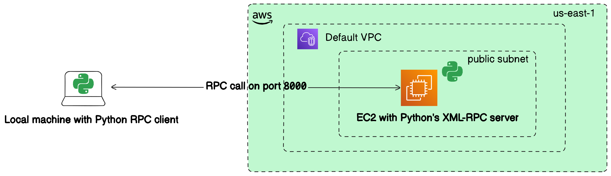

## Example of making Remote Procedure Call to a service running on a remote EC2 instance

This example demonstrates how to make a Remote Procedure Call (RPC) from your local laptop to a service running on a remote AWS EC2 instance. It uses Python's built-in `xmlrpc` library for simplicity.  Example also provides Terraform code to provision the necessary AWS infrastructure, including the EC2 instance and networking components.

**Key Takeaways**:

- **RPC Simplifies Remote Communication**: Allows you to invoke remote methods as if they were local.
- **Security Is Crucial**: Always consider security best practices when exposing services over the internet.

**Disclaimer**: This example is for educational purposes. In a production environment, additional considerations are necessary, such as robust error handling, logging, security enhancements (authentication, encryption), and scalability.

### **Overview**



- **Server**: A Python XML-RPC server running on an AWS EC2 instance.
- **Client**: A Python script running on your laptop that calls the remote procedure on the server.
- **Infrastructure**: Provisioned using Terraform, including:
  - An EC2 instance running Amazon Linux 2.
  - Security Group configured to allow incoming traffic on the RPC port (port 8000).

### **Prerequisites**

- **SSH Key Pair**: An existing SSH key pair to access the EC2 instance.
  - **Note**: For security reasons, Terraform cannot create SSH key pairs with private keys. You need to create one beforehand and make sure it's registered in AWS.
- **Python**: Installed on both your laptop and the EC2 instance (Python 3 recommended).

---

### **Prepare the SSH Key Pair**

Before running the Terraform code, ensure you have an SSH key pair:

1. **Generate a Key Pair (if you don't have one)**:

   ```bash
   ssh-keygen -t rsa -b 2048 -f my-ec2-keypair
   ```

   This will generate `my-ec2-keypair` (private key) and `my-ec2-keypair.pub` (public key).

2. **Import the Public Key into AWS**:

   - Go to the AWS Management Console.
   - Navigate to **EC2** > **Key Pairs**.
   - Click **Import Key Pair**.
   - Name it `my-ec2-keypair` and upload the contents of `my-ec2-keypair.pub`.

### **Deploy the Infrastructure with Terraform**

1. **Initialize the Terraform Project**:

   ```bash
   terraform init
   ```

2. **Preview the Changes**:

   ```bash
   terraform plan
   ```

3. **Apply the Changes to Create Resources**:

   ```bash
   terraform apply
   ```

4. **Note the Public IP Address**:

   After the resources are created, Terraform will output the details. Note the public IP address of the EC2 instance. 

### **Set Up the RPC Server on the EC2 Instance**

1. **Connect to the EC2 Instance via SSH**:

   ```bash
   ssh -i my-ec2-keypair ec2-user@<public-ip-address>
   ```

   Replace `<public-ip-address>` with the Public IP assigned to your instance.

2. **Verify Python Installation**:

   ```bash
   python3 --version
   ```

   If Python 3 is not installed, install it:

   ```bash
   sudo yum update -y
   sudo yum install -y python3
   ```

3. **Create the RPC Server Script**:

   ```bash
   vim server.py
   ```

   Paste the following code:

   ```python
   from xmlrpc.server import SimpleXMLRPCServer

   def add_numbers(x, y):
       """Adds two numbers and returns the result."""
       return x + y

   # Create an XML-RPC server
   server = SimpleXMLRPCServer(("0.0.0.0", 8000))
   print("Server is listening on port 8000...")

   # Register the function so it can be called via RPC
   server.register_function(add_numbers, "add_numbers")

   # Run the server's main loop
   server.serve_forever()
   ```

   **Note**: The `"0.0.0.0"` address is used to listen on all network interfaces.

4. **Run the RPC Server**:

   ```bash
   python3 server.py
   ```

   You should see:

   ```
   Server is listening on port 8000...
   ```

   **Optional**: To keep the server running after you log out, you can use `screen`, `tmux`, or run the script as a background process.

   - **Using `screen`**:

     ```bash
     sudo yum install -y screen
     screen -S rpc_server
     python3 server.py
     ```

     Press `Ctrl+A` then `D` to detach.

---

### **Run the RPC Client on Your Laptop**

1. **Place the public IP of EC2 instance**:
   
   Open `client.py` file and replace `<ec2_public_ip>` with the Public IP of your EC2 instance.

2. **Run the Client Script**:

   ```bash
   python3 client.py
   ```

   You should see:

   ```
   The result is: 7
   ```

### **Running Unit Tests**

To run unit tests:
```bash
python -m unittest test_add_numbers.py
```

These unit tests use the **real remote calls** to the RPC server on EC2 instance. 

### **Security Considerations**

- **Restrict Inbound Traffic**:

  - For security, you should restrict the inbound rules in your Security Group to allow traffic only from your IP address.
  - You can find your public IP address by visiting [whatismyip.com](https://www.whatismyip.com/) or use the `get_public_ip.sh` script.

- **Firewall on EC2 Instance**:

  - Ensure that the EC2 instance's firewall (iptables) allows incoming connections on port 8000.
  - Amazon Linux 2 typically doesn't have restrictive iptables rules by default.

- **SSL/TLS Encryption**:

  - For production use, consider securing the RPC communication using SSL/TLS to encrypt the data transmitted over the network.

- **Authentication (Optional)**:

  - Implement authentication mechanisms to ensure that only authorized clients can call your RPC server.

### **Cleaning Up Resources**

To avoid incurring charges on your AWS account, destroy the resources when you're done:

```bash
terraform destroy
```

### **References**

- **AWS Provider for Terraform**: [https://registry.terraform.io/providers/hashicorp/aws/latest/docs](https://registry.terraform.io/providers/hashicorp/aws/latest/docs)
- **Python xmlrpc Library**: [https://docs.python.org/3/library/xmlrpc.html](https://docs.python.org/3/library/xmlrpc.html)
- **AWS EC2 User Guide**: [https://docs.aws.amazon.com/ec2/index.html](https://docs.aws.amazon.com/ec2/index.html)