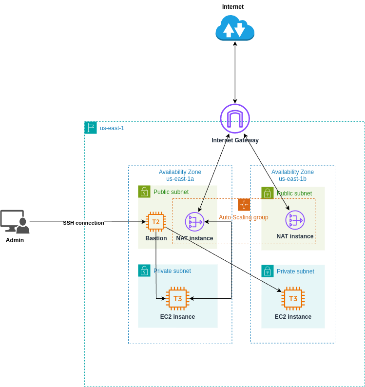

# NAT instance setup in non-production environments

This example project demonstrates the configuration that ensures **high availability** and **cost efficiency** of NAT instances in a non-production environment. You can use this project as a testing environment for developers. The cost compared to NAT gateways is lower, however it requires administering and maintenance activities for NAT instances.



- Deploying each NAT instance in a separate AZ provides **high-availability**
- Auto-scaling group provides **horizontal scaling** ensuring that at any moment in time the specified number of NAT instances is up and running

# Table of contents:
- [AWS NAT Instances vs. AWS NAT Gateways](#aws-nat-instances-vs-aws-nat-gateways)
- [Key Differences](#key-differences)
- [Best Practices](#best-practices)
- [Use Cases](#use-cases)
- [Summary](#summary)
- [Provision project](#provision-project)
    - [Create a Key Pair](#create-a-key-pair)
    - [Initialize the project](#initialize-the-project)
    - [Disable host checking](#disable-host-checking)
    - [Transfer SSH key into Bastion host](#transfer-ssh-key-into-bastion-host)
    - [Verify the connection to the Internet from private instance](#verify-the-connection-to-the-internet-from-private-instance)
- [References](#references)

### AWS NAT Instances vs. AWS NAT Gateways

For more information about differences between NAT instances and NAT Gateways, see [Compare NAT gateways and NAT instances](https://docs.aws.amazon.com/vpc/latest/userguide/vpc-nat-comparison.html)

#### **AWS NAT Instances**
- **Definition**: A [NAT (Network Address Translation) instance](https://docs.aws.amazon.com/vpc/latest/userguide/VPC_NAT_Instance.html) is an EC2 instance configured to allow instances in a private subnet to connect to the internet or other AWS services, while preventing incoming connections from the internet.
- **Setup**: Manually configure a NAT instance by launching an EC2 instance in a public subnet and enabling IP forwarding.
- **Management**: Requires manual scaling, monitoring, and updates.
- **Customizability**: Highly customizable—you can install custom software, apply specific configurations, or use it for specialized use cases.
- **Performance**: Limited by the instance type and size you select. No inherent redundancy.
- **Cost**: May be less expensive for small-scale setups because it only incurs EC2 instance and [data transfer costs](https://aws.amazon.com/ec2/pricing/on-demand/#:~:text=Generation%20Instances%20page.-,Data%20Transfer,-The%20pricing%20below).
- **Security**: Requires manual setup of security groups, network ACLs, and [instance-specific hardening](https://docs.aws.amazon.com/AWSEC2/latest/UserGuide/ec2-best-practices.html).

#### **AWS NAT Gateways**
- **Definition**: A [managed NAT service](https://docs.aws.amazon.com/vpc/latest/userguide/vpc-nat-gateway.html) provided by AWS that allows instances in a private subnet to access the internet securely.
- **Setup**: Simple to set up via the AWS Management Console or AWS CLI. The NAT gateway is automatically deployed in a public subnet.
- **Management**: Fully managed by AWS, with built-in scaling and high availability within an Availability Zone.
- **Customizability**: Limited customization compared to NAT instances.
- **Performance**: Scales automatically to handle high volumes of traffic. Supports up to 45 Gbps.
- **Cost**: Higher cost due to [per-hour NAT Gateway usage fees](https://docs.aws.amazon.com/vpc/latest/userguide/nat-gateway-pricing.html) and data processing charges.
- **Security**: Security group configurations aren't needed for the NAT Gateway itself; it's inherently secure by design.

---

### **Key Differences**
| Feature              | NAT Instance                | NAT Gateway                   |
|----------------------|----------------------------|--------------------------------|
| **Management**       | Manual                     | Fully managed by AWS          |
| **Performance**      | Limited by instance size   | Scalable up to 45 Gbps        |
| **Redundancy**       | Needs manual setup         | High availability in one AZ   |
| **Customizability**  | Highly customizable         | Limited customization         |
| **Cost**             | Lower at low traffic levels | Higher, especially for high traffic |
| **Setup Complexity** | Requires configuration      | Simple to deploy              |
| **Monitoring**       | Needs manual setup         | Integrated with AWS metrics   |

---

### **Best Practices**

#### **For NAT Instances**
1. **Instance Type**:
   - Use an instance type with enhanced networking for better performance (e.g., T3, C5).
2. **High Availability**:
   - Use an Auto Scaling Group and health checks to replace a failed instance automatically.
   - Use multiple NAT instances in different AZs to avoid single points of failure.
3. **Security**:
   - Harden the NAT instance by disabling unnecessary services and securing access.
   - Configure security groups and network ACLs properly.
4. **Monitoring**:
   - Use CloudWatch metrics to monitor network performance and usage.
   - Configure detailed logging via custom tools.

#### **For NAT Gateways**
1. **Redundancy**:
   - Deploy NAT Gateways in multiple Availability Zones for fault tolerance.
2. **Cost Optimization**:
   - Optimize the data transfer by reducing unnecessary traffic through the NAT Gateway.
   - Use private endpoints for frequently accessed AWS services to minimize data charges.
3. **Performance**:
   - Use NAT Gateways for high-throughput applications, as they scale automatically.
4. **Monitoring**:
   - Use AWS CloudWatch for monitoring and alarms on metrics like packets in/out or errors.

---

### **Use Cases**

#### **When to Use NAT Instances**
- When cost is a primary concern for low-traffic environments.
- When custom software or configurations are required (e.g., custom firewalls, traffic shaping).
- In smaller environments or test setups where scalability and redundancy are not critical.

#### **When to Use NAT Gateways**
- For production environments requiring high reliability and scalability.
- For high-throughput workloads that demand consistent performance.
- When simplicity and minimal operational overhead are priorities.
- For organizations that prefer fully managed AWS services with built-in monitoring and security.

---

### **Summary**
- **NAT Instances** are cost-effective and flexible but require significant management and operational effort.
- **NAT Gateways** are more suitable for production environments due to their scalability, simplicity, and fault-tolerant design, though they come at a higher cost.
- Select the option that aligns with your workload, scalability requirements, and budget. For most production use cases, **NAT Gateways** are recommended for their reliability and ease of use.


## Provision project

### Create a Key Pair

To be able to SSH into Bastion host and NAT instances, provision the SSH key:
```bash
aws ec2 create-key-pair --key-name ssh-key-pair --query 'KeyMaterial' --output text > ssh-key-pair.pem
chmod 400 ssh-key-pair.pem
```

### Initialize the project

Run the following commands to deploy the infrastructure:
```bash
terraform init
terraform apply
```

### Disable host checking

In order to make NAT instances to be able to process the traffic, you need to disable host checking:
```bash
./disable_source_dest_check.sh
```

This Bash script disables source and destination checks on NAT instances. For more information, see [Disable source/destination checks](https://docs.aws.amazon.com/vpc/latest/userguide/work-with-nat-instances.html#EIP_Disable_SrcDestCheck)

### Transfer SSH key into Bastion host

In order to SSH into private instance from Bastion host, you need to transfer the SSH key. One of the option is to create the key on Bastion host:
```bash
# Copy the contents of the private SSH key from local machine
xclip -sel clip < ssh-key-pair.pem

# On Bastion host machine
touch ssh-key-pair.pem
chmod 400 ssh-key-pair.pem

# Paste the contents of the private SSH key
vim ssh-key-pair.pem
```

### Verify the connection to the Internet from private instance

SSH into private instance from Bastion host:
```bash
ssh -i ssh-key-pair.pem ec2-user@<private_ip>
```

Ping `google.com`:
```bash
ping google.com
```

## References

- [AWS Docs: NAT instances](https://docs.aws.amazon.com/vpc/latest/userguide/VPC_NAT_Instance.html)