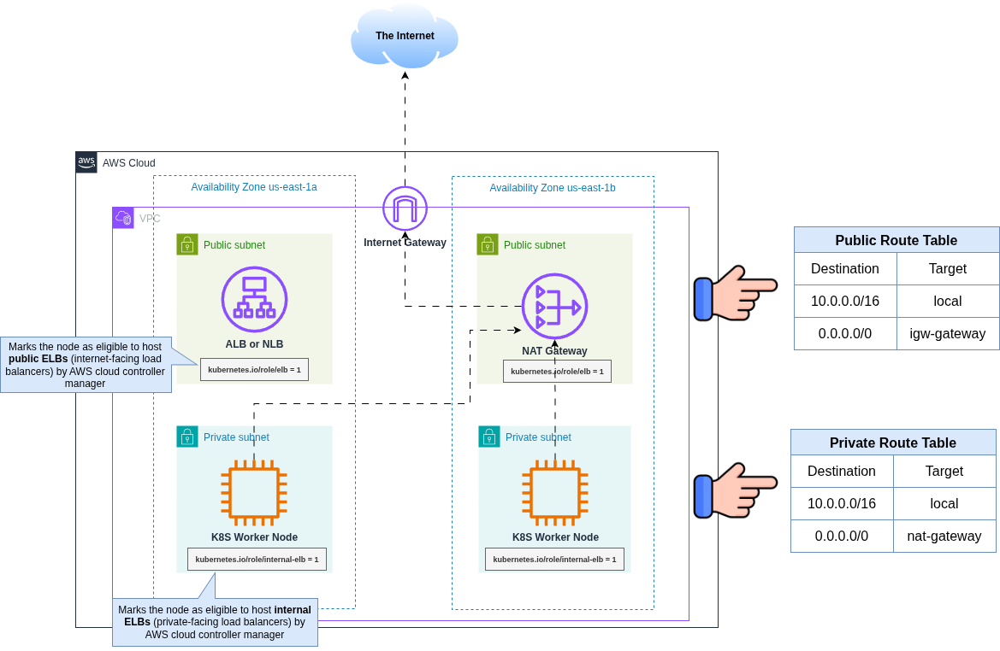
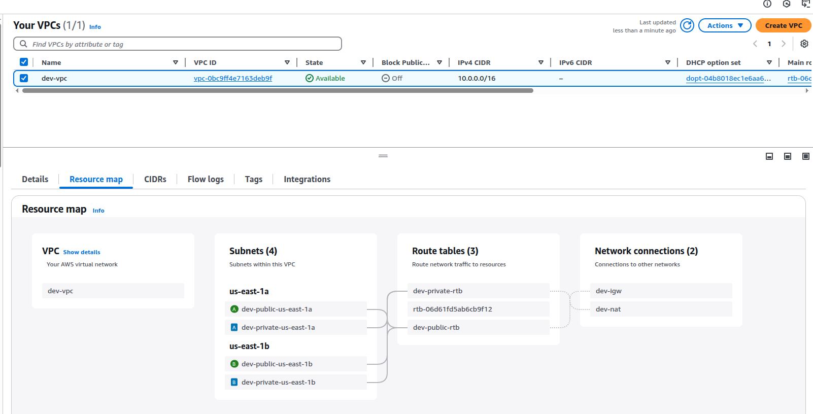

# Provision standard type of VPC for EKS cluster

This demo project shows how to provision VPC with 2 public and 2 private subnets in 2 AZs for EKS cluster



## Overview

When you create a EKS cluster, you need to **specify VPC with at least two subnets that are in different AZs**. For more information, see [VPC and Subnet Considerations](https://docs.aws.amazon.com/eks/latest/best-practices/subnets.html).

An EKS cluster consists of two VPCs:
- An **AWS-managed VPC** that **hosts the Kubernetes control plane**. This VPC **does not appear** in the customer account.
- A **customer-managed VPC** that **hosts the Kubernetes worker nodes**. This is where containers run, as well as other customer-managed AWS infrastructure such as load balancers used by the cluster. This VPC appears in the customer account. You need to create customer-managed VPC prior creating a cluster. 

The **worker nodes in the customer VPC need the ability to connect to the managed API server endpoint** in the AWS VPC. This allows the nodes to register with the Kubernetes control plane and receive requests to run application Pods.


- Kubernetes version `1.32`. For more information, see [EKS Kubernetes Standard Support Versions](https://docs.aws.amazon.com/eks/latest/userguide/kubernetes-versions-standard.html)

## Project structure

The project is structured as follows:
```bash
.
├── 0-locals.tf
├── 1-provider.tf
├── 2-vpc.tf
├── 3-igw.tf
├── 4-subnets.tf
├── 5-nat.tf
├── 6-routes.tf
```

| **File**        | **Purpose**                                                                                                                                                                |
| --------------- | -------------------------------------------------------------------------------------------------------------------------------------------------------------------------- |
| `0-locals.tf`   | ✅ **Defines local variables** that are used throughout the config (e.g., environment name, AZs, CIDR blocks). Helps avoid duplication and centralizes configuration logic. |
| `1-provider.tf` | ✅ **Declares the AWS provider** and its configuration (e.g., region, version). This is required for Terraform to know how and where to create resources.                   |
| `2-vpc.tf`      | ✅ **Creates the main VPC** resource, specifying the CIDR block and DNS settings. This is the network foundation.                                                           |
| `3-igw.tf`      | ✅ **Creates the Internet Gateway**, used to route traffic from public subnets to the internet.                                                                             |
| `4-subnets.tf`  | ✅ **Creates public and private subnets** in different Availability Zones. Tags are applied to support Kubernetes integration (e.g., EKS).                                  |
| `5-nat.tf`      | ✅ **Creates a NAT Gateway and Elastic IP**. Used for providing internet access to private subnets without exposing them directly.                                          |
| `6-routes.tf`   | ✅ **Creates route tables and associations** for both public and private subnets. Defines how traffic flows within the VPC and out to the internet or NAT gateway.          |

File numbering helps to logically order the resources and improve readability. However, note that Terraform treats all `.tf` files in a directory equally and loads them in an unordered fashion before building the resource dependency graph.

## VPC Configuration

Enable DNS and Hostnames support in your VPC:
```hcl
enable_dns_support = true
enable_dns_hostnames = true
```

This is required for EKS addons such as [EFS CSI driver](https://www.eksworkshop.com/docs/fundamentals/storage/efs/efs-csi-driver), AWS Client VPN and EKS worker nodes to communicate.

In a **VPC used for EKS worker nodes**, these settings are critical for enabling internal name resolution and proper DNS behavior inside the cluster:

---

### `enable_dns_support = true`

**Purpose:**
Enables **Amazon-provided DNS** within the VPC.

**What it does:**

* Ensures that instances in the VPC (e.g., EKS nodes or pods) can **resolve public DNS names** (like `amazonaws.com`) and **VPC internal hostnames** (like other EC2 private DNS names).
* Necessary for cluster components that rely on internal name resolution, such as `CoreDNS`, which resolves Kubernetes service names.

**When to enable:**  
🔹 **Always enable** this for any EKS (or EC2) deployment.
Without it, DNS resolution won’t work, breaking basic cluster functionality.

---

### `enable_dns_hostnames = true`

**Purpose:**
Enables assigning **DNS hostnames** (like `ip-10-0-1-12.ec2.internal`) to EC2 instances launched in the VPC.

**What it does:**

- Lets EC2 instances (EKS worker nodes) receive a private DNS name associated with their private IP.
- Important for internal Kubernetes operations like:

  - **Kubelet registration**
  - **Node name resolution**
  - **IAM roles for service accounts (IRSA)** via hostname-based DNS calls to the metadata service

**When to enable:**  
- Required **if your subnets are public** or you use **custom DNS setups**, or want to rely on EC2 DNS names.
- Also required for **IRSA to work**, especially with `amazonaws.com` endpoints routed via DNS.

---

| Setting                | Needed for EKS | Why It’s Important                               | Enable in EKS? |
| ---------------------- | -------------- | ------------------------------------------------ | -------------- |
| `enable_dns_support`   | ✅ Yes          | Enables DNS resolution inside the VPC            | ✅ Always       |
| `enable_dns_hostnames` | ✅ Yes          | Assigns DNS names to EC2 instances (EKS workers) | ✅ Usually      |

| **Attribute**        | **Description**                                                                                                                                                                                                                                                                                     |
| -------------------- | --------------------------------------------------------------------------------------------------------------------------------------------------------------------------------------------------------------------------------------------------------------------------------------------------- |
| `enableDnsHostnames` | Controls whether EC2 instances in the VPC are assigned **DNS hostnames**.<br><br>🔹 If an instance has a **public IP**, enabling this allows it to get a **public DNS name** like `ec2-54-123-45-67.compute-1.amazonaws.com`.<br><br>🔹 Defaults to `false`, unless the VPC is the **default VPC**. |
| `enableDnsSupport`   | Controls whether the VPC supports **DNS resolution** using the **Amazon-provided DNS server**.<br><br>🔹 Must be `true` for EC2 instances (and EKS nodes) to resolve domain names like `amazonaws.com` or internal names.<br><br>🔹 Defaults to `true`.                                             |

For more information, see [VPC requirements and considerations](https://docs.aws.amazon.com/eks/latest/userguide/network-reqs.html#network-requirements-vpc)

## Subnets Configuration

If you want to deploy load balancers to a subnet, the subnet must have the following tags:
```hcl    
# Used by Kubernetes to mark as internal load balancer subnet
"kubernetes.io/role/internal-elb" = "1"

# Tag for public load balancer use in Kubernetes
"kubernetes.io/role/elb" = "1"
```

## Shared and Owned Tag Values 

The tag `kubernetes.io/cluster/<cluster-name>` with values like **`owned`** or **`shared`** is used by **Amazon EKS** and the **Kubernetes cloud controller manager** to identify subnets, security groups, and other AWS resources that belong to or are usable by the cluster.

---

| **Tag Key**                        | **Tag Value** | **Meaning**                                                                                                                                                                            |
| ---------------------------------- | ------------- | -------------------------------------------------------------------------------------------------------------------------------------------------------------------------------------- |
| `kubernetes.io/cluster/my-cluster` | `owned`       | The resource (e.g., subnet, security group) is **created and exclusively used** by this EKS cluster. EKS may delete or modify it during cluster lifecycle operations (e.g., deletion). |
| `kubernetes.io/cluster/my-cluster` | `shared`      | The resource is **shared** among multiple clusters or manually managed. EKS will **not delete or modify** it when the cluster is deleted.                                              |

---

* **`owned`**:

  * You created the resource specifically for this EKS cluster.
  * You're okay with EKS managing the lifecycle of that resource.
  * Safe for EKS to clean up on cluster deletion.

* **`shared`**:

  * The resource (like a subnet or SG) is **reused** across clusters or managed externally.
  * You **don’t want EKS to delete or change** it automatically.
  * Useful in **multi-cluster setups** or **shared VPCs**.

---

```hcl
tags = {
  "kubernetes.io/cluster/my-cluster" = "owned"   # EKS manages this resource
}
```

vs.

```hcl
tags = {
  "kubernetes.io/cluster/my-cluster" = "shared"  # You manage this resource
}
```

For more information, see [Subnet requirements for nodes](https://docs.aws.amazon.com/eks/latest/userguide/network-reqs.html#:~:text=Subnet%20requirements%20for%20nodes)

## Provision VPC

To provision VPC:
```bash
terraform apply
```

You'll get the following VPC:



## References
- [AWS Docs: View Amazon EKS networking requirements for VPC and subnets](https://docs.aws.amazon.com/eks/latest/userguide/network-reqs.html)
- [YouTube: Create AWS VPC using Terraform: AWS EKS Kubernetes Tutorial](https://www.youtube.com/watch?v=aRXg75S5DWA&list=PLiMWaCMwGJXnKY6XmeifEpjIfkWRo9v2l)